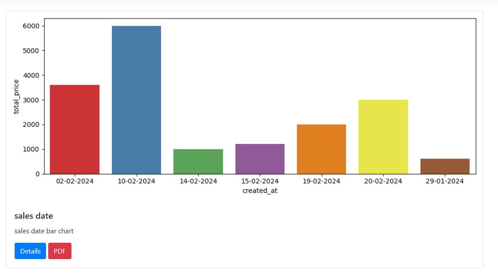
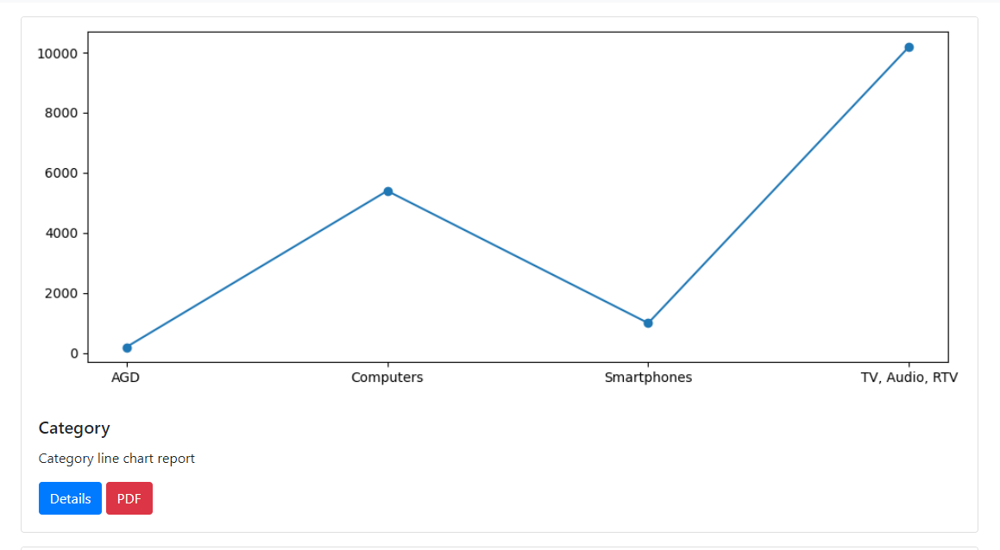
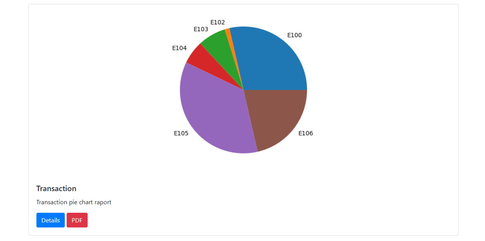
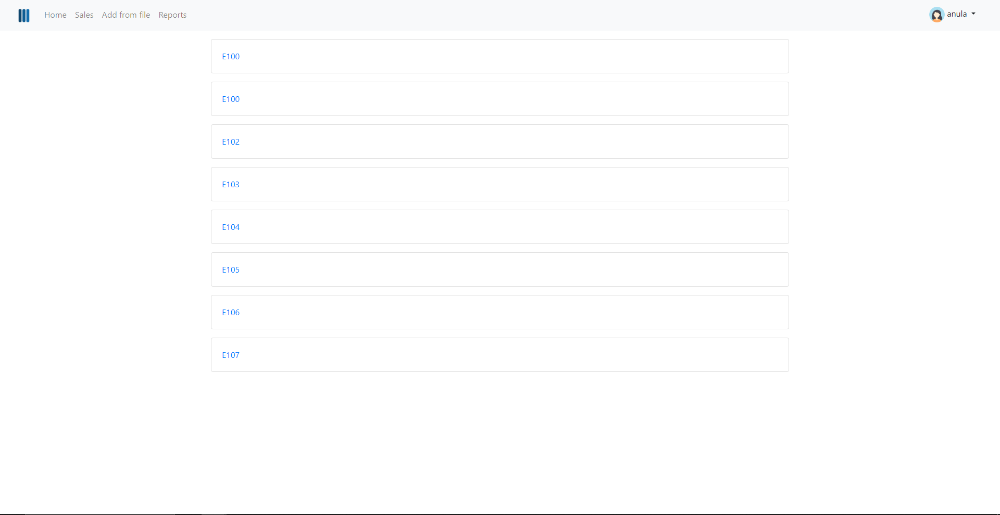
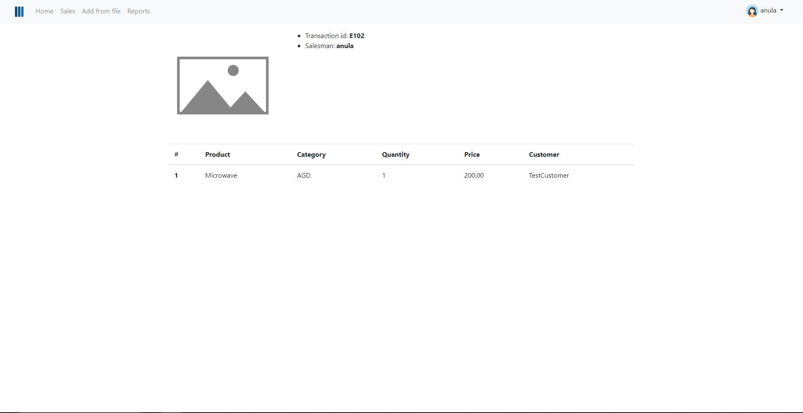
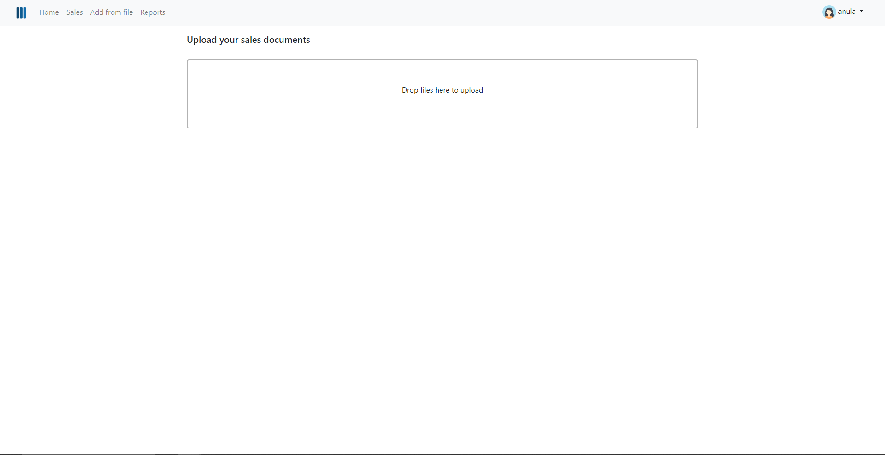
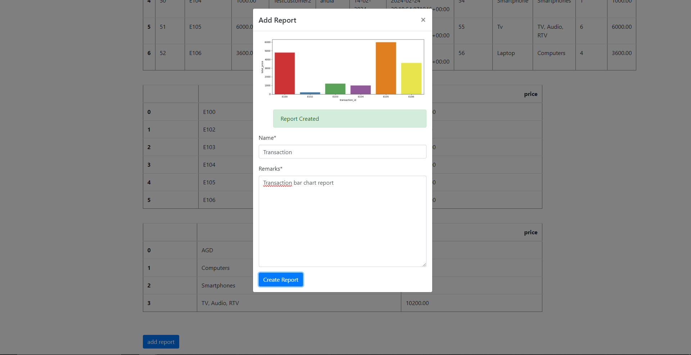
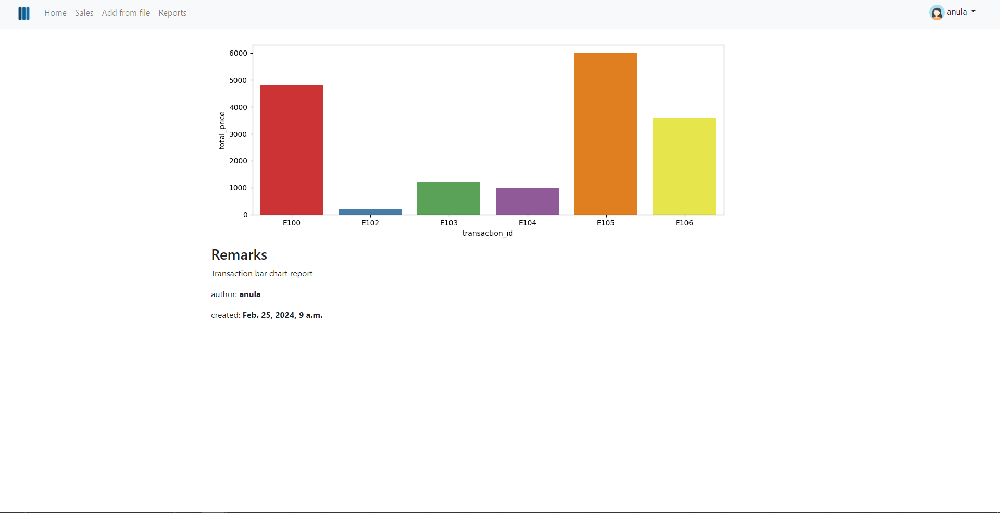
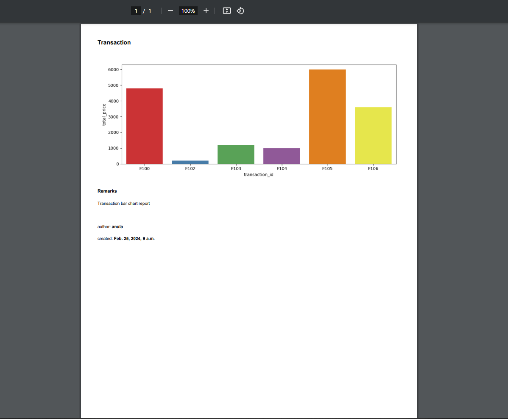

#  Sales Analysis With Graph Generation

Web-application that analyses sales data by interactively searching data for analyzing, extracting sales data, importing data from a csv file, analyzing by category, transaction id, date and presenting them by bar chart, line chart or pie chart. Creation of a report and generation of pdf report.

## Technologies
- **Python**: Main programming language.
    -  Version 3.12

- **Django**: A web framework for Python applications.
    - Version: 4.2.6

- **PostgreSQL**: Relational database management system.
    - Version: 16

- **pandas**:  Open source data analysis and manipulation tool
    -Version: 2.2.0

- **matplotlib**: Comprehensive library for creating static, animated, and interactive visualizations
    -Version: 3.8.3

- **xhtml2pdf**: HTML to PDF converter
    - Version: 0.2.15

- **psycopg**: PostgreSQL database adapter for Python.
    - Version: 3.1.12

- **SQLparse**: Library for parsing and manipulating SQL queries in Python.
  - Version: 0.4.4

- **HTML5**: Markup language for structuring content.

- **CSS**: Style sheets for styling the user interface.

- **JavaScript**: Used for dynamic page functions.

- **jQuery**: A JavaScript library for facilitating HTML document manipulation.
  - Version: 3.6.0

- **crispy-bootstrap4**: Bootstrap 4 integration with Django Crispy Forms.
    - Version: 2023.1

- **Pillow**: Python image handling library.
    - Version: 10.1.0

- **Dropzone.js**:  provides easy to use drag'n'drop file uploads with image previews.

# Project

## Content

1. [Searching data](#searching-data)
2. [Extract sales data](#extract-sales-data)
3. [Analysis by category, transaction id, date with chart presentation](#analysis-by-category-transaction-id-date-with-chart-presentation)
4. [Sales page](#sales-page)
5. [Import data from CSV file](#import-data-from-csv-file)
6. [Reports](#reports)

### Searching data

You can search for data by date. You have to also select the chart type: bar chart line chart or pie chart and from which angle you want to analyse the data: transaction, category or sales date.

### Extract sales data

There is a tables with sales, positions and merged table with sales and positions

### Analysis by category, transaction id, date with chart presentation

Tables are grouped: transaction with prices and categories with prices.
Based on higher tables it is possible to analyse by date.

We have a choice of bar chart, line chart, pie chart.

### Sales page

On the sales page we have the id of each transaction and when we go into a specific transaction there are details of that transaction.

### Import data from CSV file

You can add a CSV files that does not exceed 3mb, up to a maximum of 3 files.

### Reports

You can create a report with a specific choice of analysis (by category, transaction, sales date). All reports are on the reports page, you can go to the report details. You can create and download a pdf file.

# Other information

Project was created with the help of the course Django 3 Course - Python Web Framework (+ pandas, matplotlib, & more)